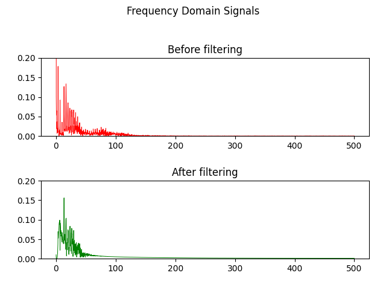
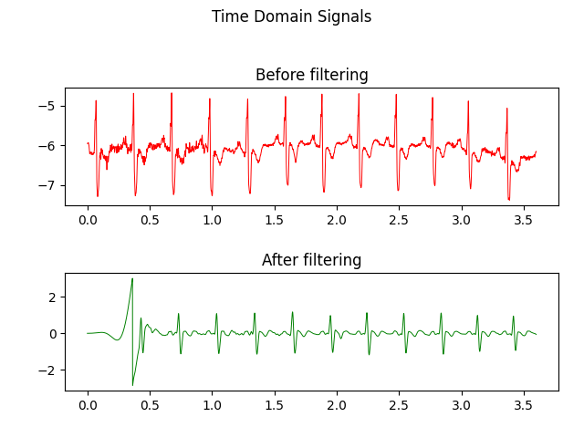
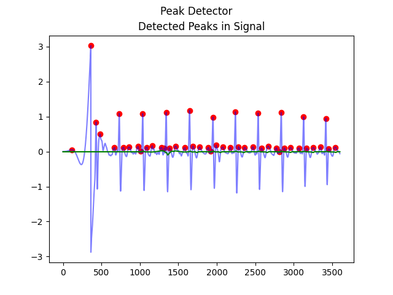

# ECG Signal Processing Pipeline

This code processes ECG signals to filter noise, transform the signal into the frequency domain, and detect R-peaks to calculate heart rate. The flow and visual outputs are structured as follows:

## 1. Frequency Domain (Filtered vs. Unfiltered)

The first part of the code reads the ECG data, calculates the **Fast Fourier Transform (FFT)** of the raw ECG signal, and displays the frequency components. This initial frequency-domain analysis highlights noise in the signal. After applying a **Butterworth filter** and a **Kaiser window filter** to remove noise (especially at 50 Hz), the frequency-domain plot of the filtered signal is generated, showing reduced noise. 

**Frequency Domain Plot (Filtered vs. Unfiltered):**

---

## 2. Time Domain (Filtered vs. Unfiltered)

The time-domain plot shows the raw ECG signal before and after filtering. The Butterworth and Kaiser filters work together to reduce baseline drift and high-frequency noise, leaving a cleaner ECG signal suitable for peak detection. This step is crucial for identifying accurate R-peaks in the ECG waveform.

**Time Domain Plot (Filtered vs. Unfiltered):**

---

## 3. Heart Rate Calculation via R-Peak Detection

After filtering, the code detects R-peaks in the ECG signal. It applies a moving average to help distinguish between heartbeats and noise. The detected peaks (R-peaks) are then used to calculate the heart rate by measuring the intervals between consecutive peaks (R-R intervals). The average heart rate is computed based on these intervals.

**R-Peak Detection for Heart Rate Calculation:**

---

This modular approach provides a clear visualization of the ECG signal processing pipeline, allowing for noise reduction, frequency analysis, and reliable heart rate estimation from the ECG signal.
